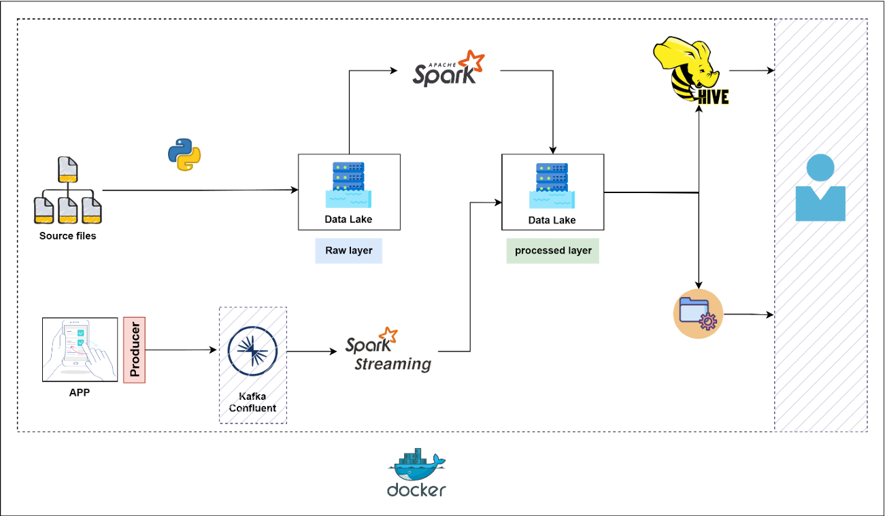

# Q-Company Data Platform 

The Q Company data platform project aims to enhance data management capabilities by handling, processing, and analyzing large data volumes from retail operations. The platform integrates both batch and streaming data processes to support business intelligence, reporting, and advanced analytics.

## Primary Objectives
1. Develop a data ingestion pipeline for batch files and streaming data from Kafka.
2. Create a scalable data storage solution using a data lake architecture.
3. Implement data processing workflows for transforming raw data into structured formats.
4. Establish a data warehouse using Hive tables for centralized business intelligence.
5. Provide actionable insights and reports to business teams.
6. Ensure data security, compliance, and performance optimization.

### Scope
- Ingest batch data files (branches, sales agents, sales transactions) into a data lake.
- Process and transform raw data into structured Hive tables.
- Implement a streaming data pipeline to process app logs from Kafka.
- Develop business-specific data models and reports.
- Ensure data security, compliance, and performance optimization.
- Provide documentation, maintenance, and support.

# Architecture and Design

### Components
1. **Data Ingestion Layer:** Collects data from batch files and real-time streams from Kafka.
2. **Data Lake:** Centralized repository for raw and processed data (HDFS).
3. **Data Processing Layer:** Utilizes Spark for data transformation, cleaning, and loading.
4. **Data Warehouse (DWH):** Built using Hive tables for business intelligence and reporting.
5. **Data Access and Analytics Layer:** Tools for data analysts, data scientists, and business users.

## Data Flow
### Data Sources:
- Batch Files: Branches, sales agents, and sales transactions files.
- Real-Time Streams: App logs pushed to Kafka cluster.

### Processing Flow:
- Batch files are ingested into HDFS every hour.
- Real-time data from Kafka is processed and stored in HDFS.
- Raw data in HDFS is processed using Spark.
- Processed data is stored as Hive tables in the data warehouse.
- Data analysts and business users access the DWH for insights and reporting.

### Data Storage
- **Data Lake:** Uses HDFS for raw and processed data.
- **Data Warehouse:** Built using Hive for structured storage and complex queries.

# Tools and Technologies
- **HDFS:** Scalable data storage.
- **Apache Spark:** Data processing, transformation, and analysis.
- **Apache Hive:** Data warehousing and SQL-based querying.
- **Apache Kafka:** Real-time data streaming.
- **Python:** Scripting and automation.

# Data Ingestion Pipeline

### Batch Data Ingestion
- Files are ingested into the data lake hourly as raw files.
- Data is partitioned for efficient storage and retrieval.

### Streaming Data Ingestion
- Kafka producer sends app logs to Kafka.
- Spark streaming job reads, processes, and stores data in HDFS.

### Data Formats and Protocols
- **Batch Files:** CSV or JSON formats.
- **Real-Time Streams:** JSON format.

# Handling Small Files Problem
- Implement a compaction strategy using PySpark.
- Combine small CSV files into a single DataFrame.
- Write merged data back as a single file to optimize performance.
